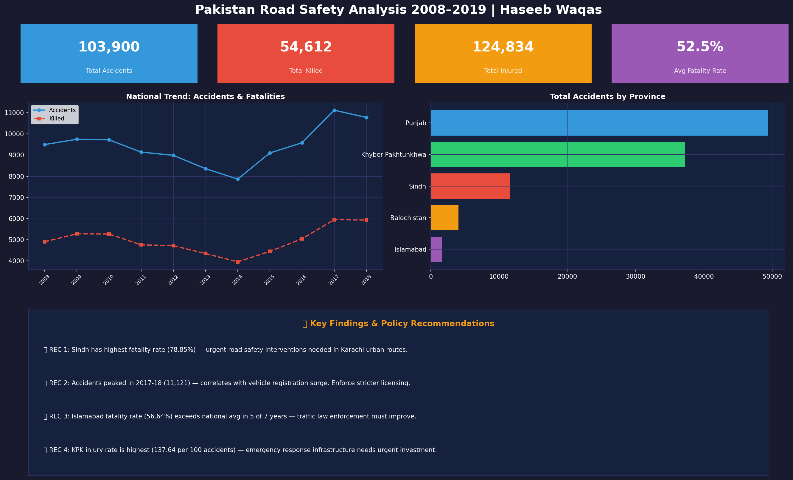

# Pakistan Road Safety Analysis (2008-2019)

End-to-end data analysis of real government road accident data across Pakistan provinces including an Islamabad deep dive, severity funnel, and policy recommendations.

---

## Dashboard Preview


---

## Project Overview

Road traffic accidents are one of Pakistan's leading causes of preventable death. This project analyzes 11 years of official government data (2008-2019) across 5 provinces and Islamabad Capital Territory.

**Questions Answered:**
- How have road accidents trended nationally over 11 years?
- Which province is most dangerous by fatality rate?
- How does Islamabad compare to the national average?
- What does the accident severity funnel look like?
- Where should policy interventions be focused?

---

## Project Structure

```
pakistan road safety analysis/
├── data/
│   ├── traffic_accidents_raw.csv       Raw government dataset
│   ├── road_safety_cleaned.csv         ETL output for Power BI
│   ├── road_safety.db                  SQLite database (3 tables)
│   └── sql_analysis_results.xlsx       10 SQL query results
├── pipeline/
│   ├── step1_etl_pipeline.py           Extract, clean, load to SQLite
│   ├── step2_sql_analysis.py           10 business SQL queries
│   └── step3_visualizations.py         10 professional charts
├── notebooks/
│   └── road safety analysis.ipynb     Full analysis notebook
├── visuals/
│   ├── 00 executive dashboard.png
│   ├── 01 national trend.png
│   ├── 02 province comparison.png
│   ├── 03 fatality rate by province.png
│   ├── 04 islamabad deep dive.png
│   ├── 05 province trends.png
│   ├── 06 killed vs injured.png
│   ├── 07 fatality rate trend.png
│   ├── 08 severity funnel.png
│   └── 09 vehicles per accident.png
├── dashboard/
│   └── power bi guide.md              Step by step Power BI guide
├── requirements.txt
└── README.md
```

---

## Key Findings

| Finding | Detail |
|---|---|
| Total Accidents | 103,900 over 11 years |
| Total Killed | 54,612 people |
| Total Injured | 124,834 people |
| Avg Fatality Rate | 52.45% of accidents are fatal |
| Most Dangerous Province | Sindh with 78.85% fatality rate |
| Most Accidents | Punjab with 49,354 total accidents |
| Islamabad | 56.64% fatality rate above national average |
| Worst Year | 2017-18 with 11,121 accidents and 5,948 killed |

---

## Severity Funnel

```
103,900   Total Accidents     100%
    ↓
 56,132   Fatal Accidents      54%
    ↓
 54,612   People Killed        53%
    ↓
124,834   People Injured      120%
```

---

## Policy Recommendations

| # | Recommendation | Target |
|---|---|---|
| 1 | Urgent safety interventions on Karachi urban routes | Sindh |
| 2 | Stricter vehicle licensing after registration surge | National |
| 3 | Improve traffic law enforcement | Islamabad |
| 4 | Emergency response infrastructure investment | KPK |

---

## Tools Used

| Tool | Purpose |
|---|---|
| Python 3 | ETL pipeline, analysis, visualization |
| Pandas | Data manipulation |
| SQLite | Database and SQL queries |
| Matplotlib and Seaborn | 10 professional charts |
| Power BI | Interactive dashboard |
| Jupyter Notebook | Analysis workflow |

---

## Data Source

Pakistan Bureau of Statistics — Annual Traffic Accidents Report
Official government data covering 2008-09 to 2018-19
Provinces: Punjab, Sindh, KPK, Balochistan, Islamabad

---

## How to Run

```bash
git clone https://github.com/YOUR_USERNAME/pakistan-road-safety-analysis.git
cd pakistan-road-safety-analysis
pip install -r requirements.txt

python pipeline/step1_etl_pipeline.py
python pipeline/step2_sql_analysis.py
python pipeline/step3_visualizations.py

jupyter notebook notebooks/road safety analysis.ipynb
```

---

## Author

**Haseeb Waqas** — Data Analyst
Email: haseeb.fr02@gmail.com
LinkedIn: linkedin.com/in/YOUR_PROFILE
GitHub: github.com/YOUR_USERNAME
